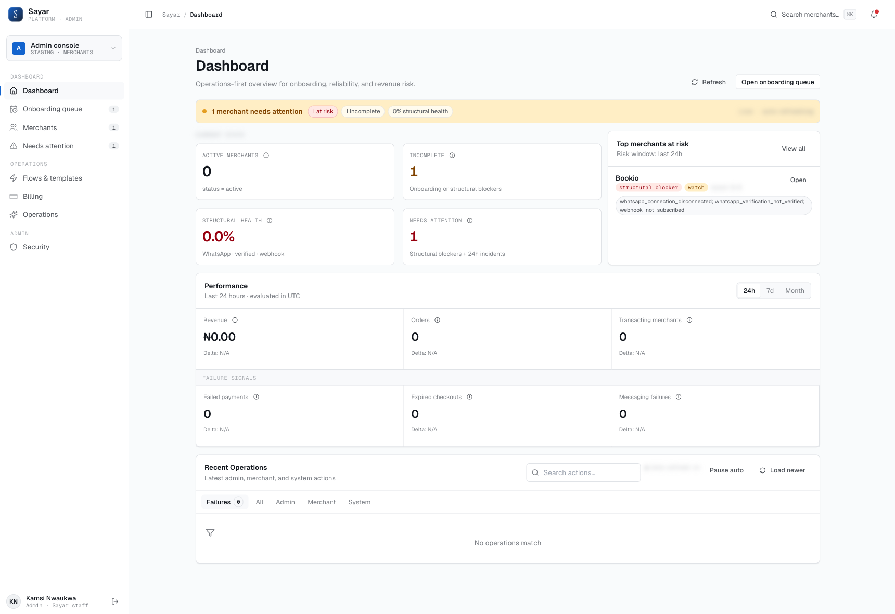

# 1. Getting Started

## Who This Is For

- Admin operators
- Ops leads
- Support staff handling merchant setup and incident triage

## What You Need Before Starting

- Admin portal access
- Correct role/permissions
- Clear environment awareness (`local`, `staging`, `production`)

## Core Principle

Treat all merchant actions as production-sensitive operations:

- Verify merchant identity before edits
- Prefer reversible actions
- Record reason for every manual override/retry

## Main Screens

- Home (dashboard)
- Onboarding queue
- Merchant directory
- Needs attention
- Flows & templates
- Billing / Operations

## Where To Click

1. Open `Dashboard` from the left sidebar.
2. Confirm environment label (`STAGING`) and queue counters.
3. Use the top search to jump to merchants quickly.

