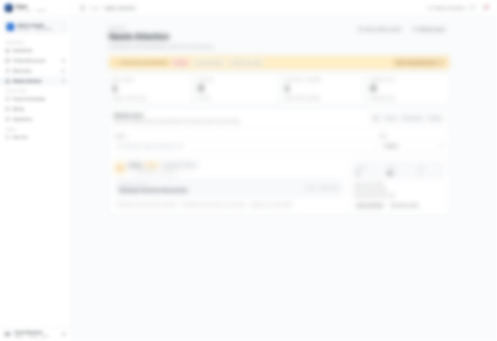
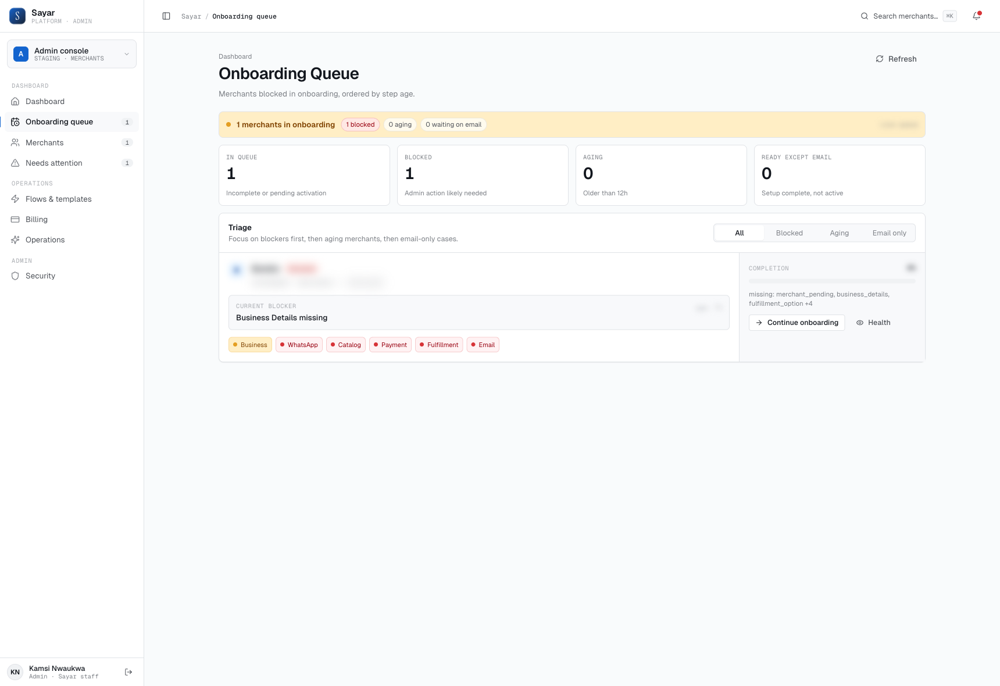

# 2. Daily Operations

## Daily Checklist

1. Check dashboard summary cards
2. Work `Needs attention` queue first
3. Work `Onboarding queue` second
4. Spot check payment provider status
5. Review unresolved retries (templates, checkout flow, integrations)

## Priority Order

1. Structural blockers (merchant cannot operate)
2. Active payment/checkout issues
3. Onboarding incompletions
4. Cosmetic or non-blocking inconsistencies

## End-of-Day Closeout

- Confirm no unresolved critical incidents
- Confirm escalations have owner + ETA
- Log major actions in internal ops notes

## Where To Click

1. Go to `Dashboard` first.
2. Open `Needs attention` and clear critical items.
3. Open `Onboarding queue` and process remaining setup tasks.

