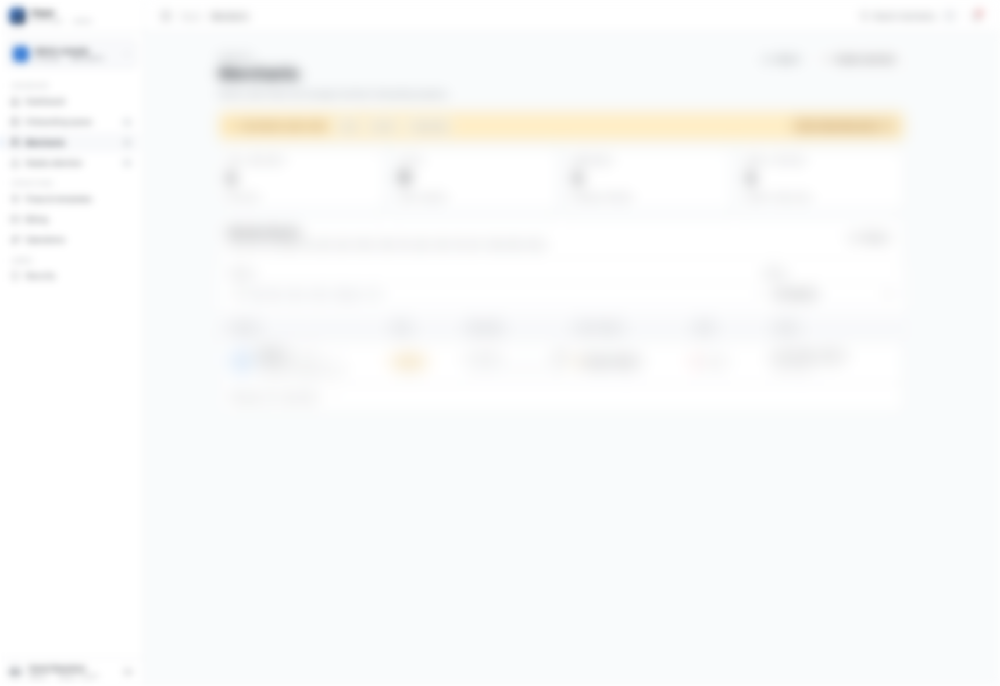
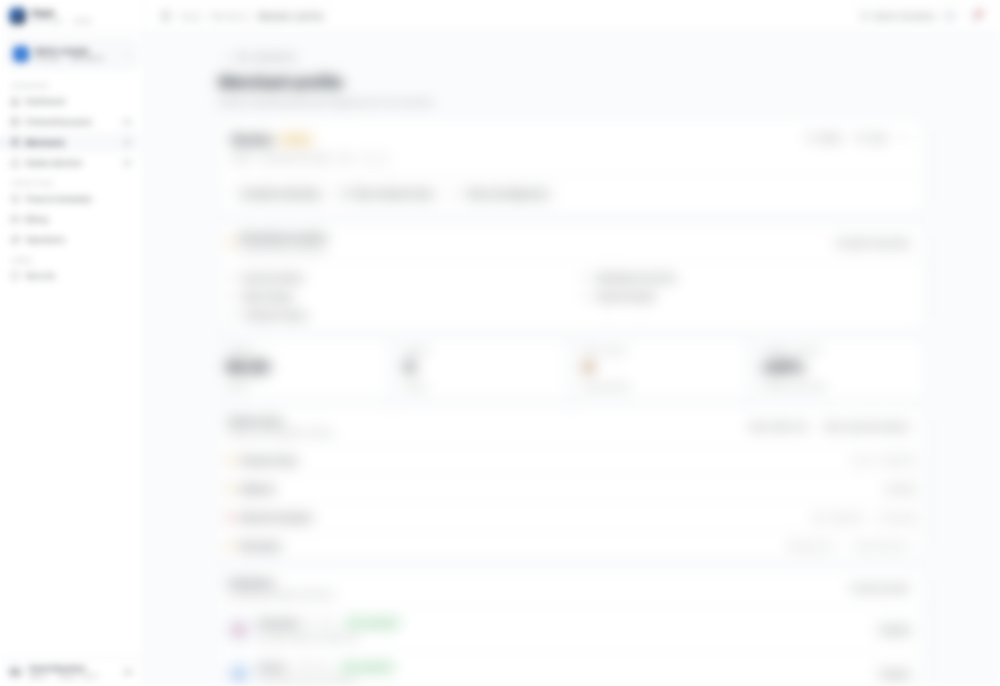

# 3. Merchant Lifecycle

## Lifecycle Stages

1. Merchant created
2. Onboarding started
3. Onboarding completed
4. Activation checks passed
5. Active and transacting

## Important Clarification

Onboarding completion and merchant activation are related but not identical:

- Onboarding complete means required setup is done
- Activation depends on status/verification gates as well

## Admin Responsibilities by Stage

- Created: verify identity fields are correct
- Onboarding: drive completion in required order
- Pre-active: clear structural blockers
- Active: monitor health and incidents

## Where To Click

1. Open `Merchants` from sidebar.
2. Select a merchant row to open profile.
3. Use profile actions to continue onboarding and health review.

