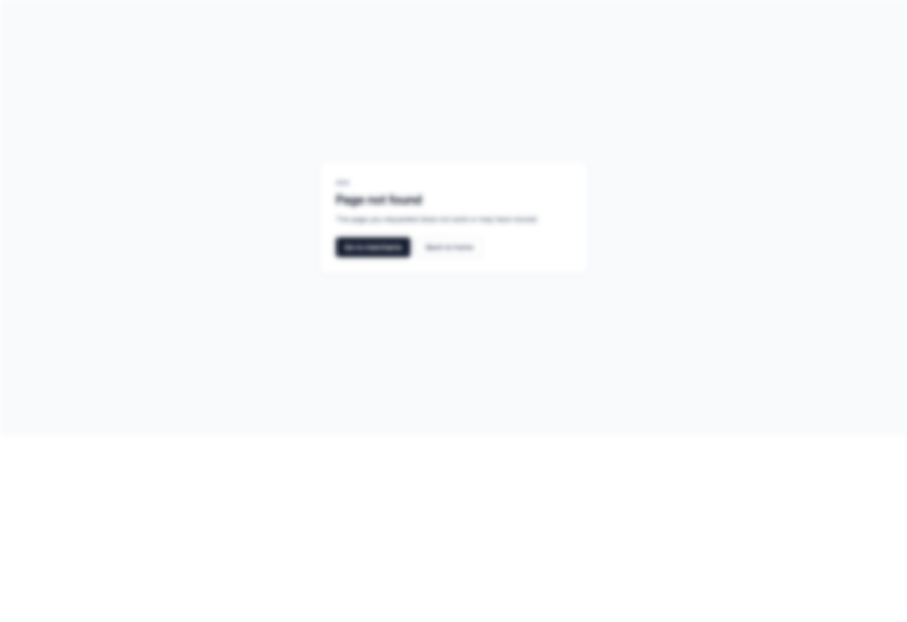

# 8. Required Templates

## What This Covers

Required WhatsApp template readiness per merchant.

## Status Meanings

- `ready`: approved and usable
- `pending`: queued/in-progress/pending approval
- `failed`: failed/rejected/paused/disabled
- `missing`: required template row not found
- `stale`: template exists but definition mismatch

## Retry Rules

Eligible for retry:

- missing
- failed
- stale

Not eligible:

- ready
- pending

## Operational Tip

If retries repeatedly fail, verify merchant credentials and template definition alignment before retrying again.

## Where To Click

1. Open `Flows & templates`.
2. Review template status and required coverage.
3. Use merchant profile retry actions when template states are failed/missing/stale.

